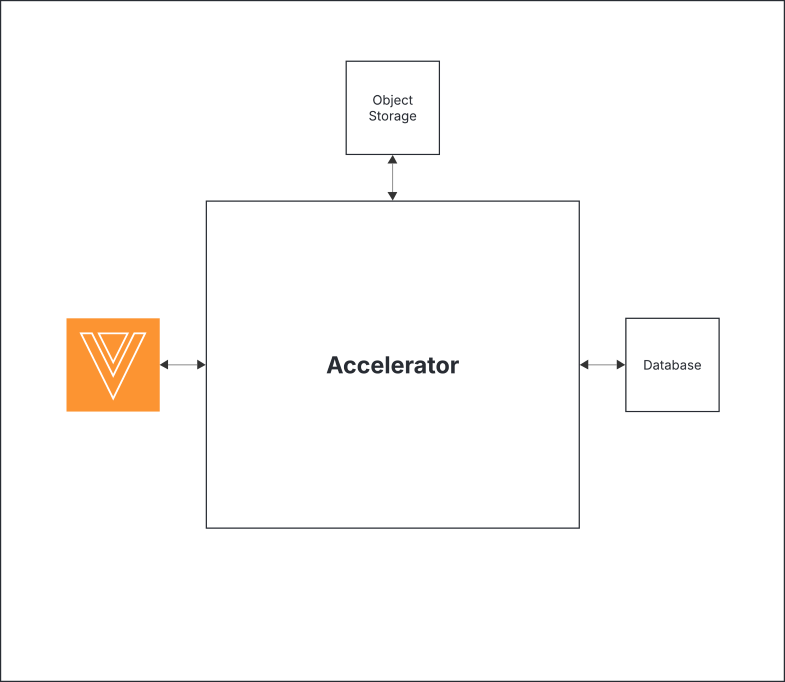
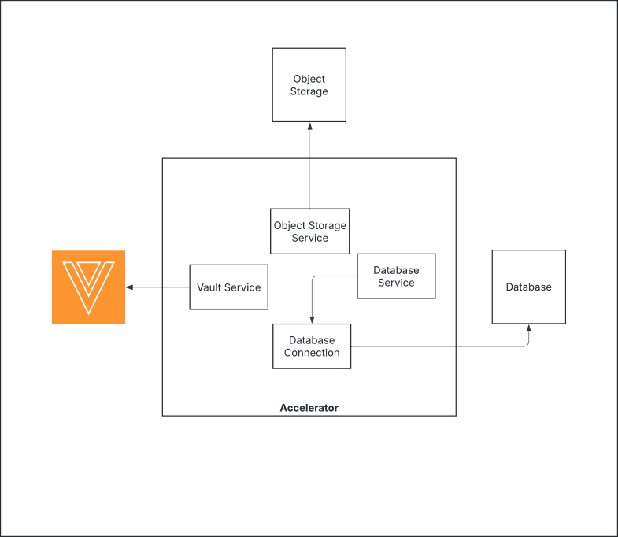
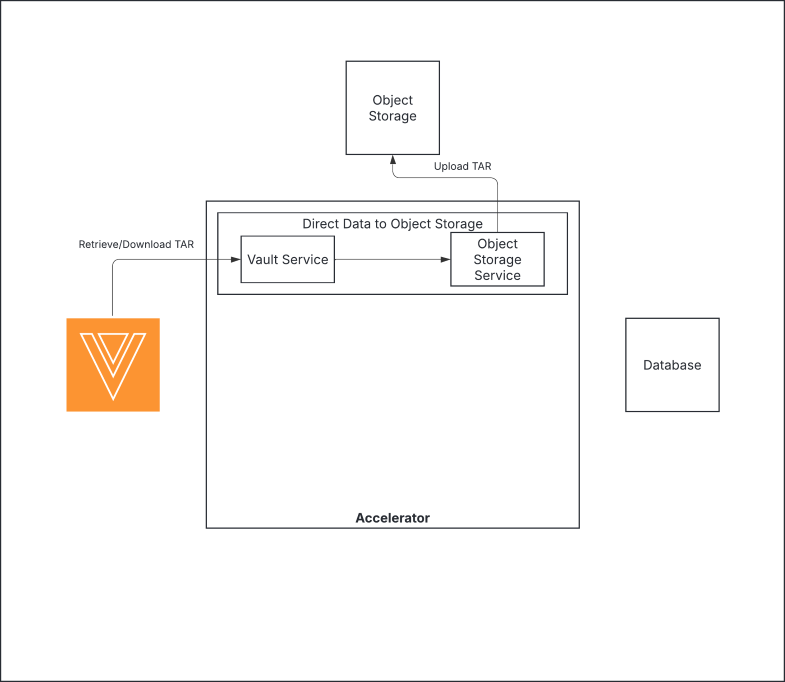
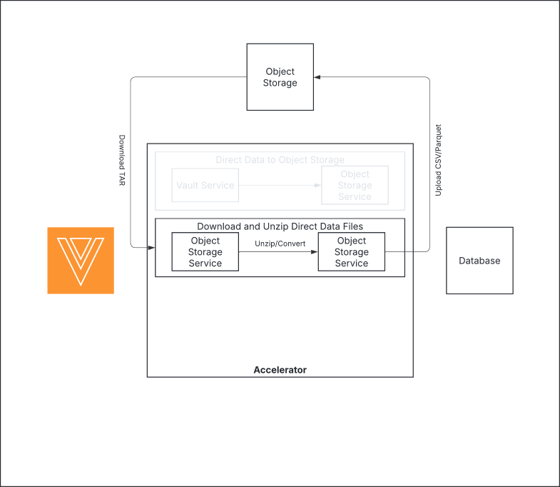
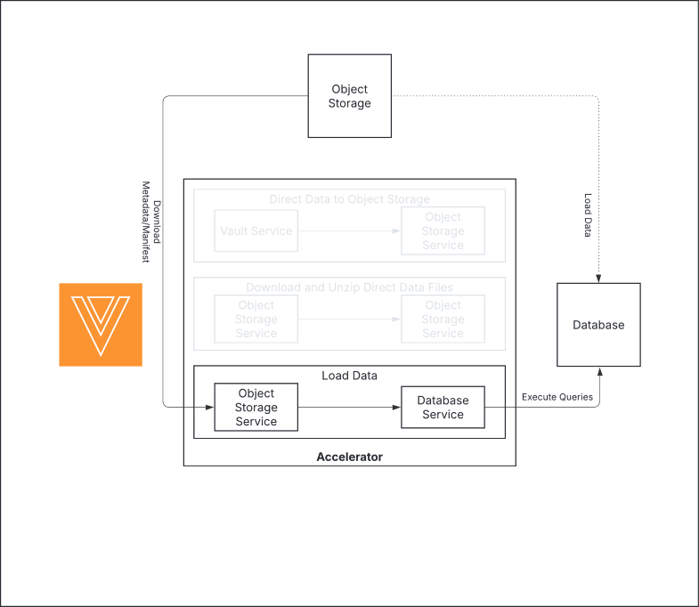
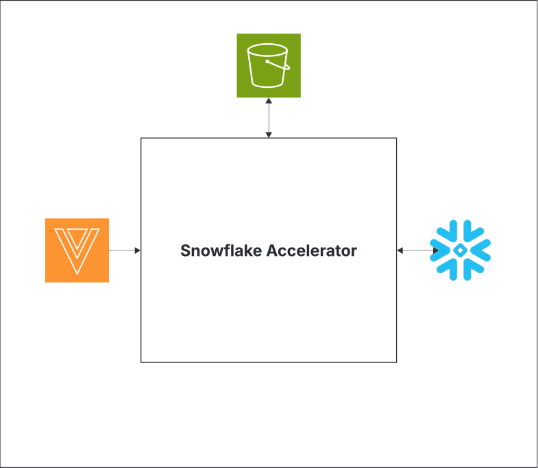
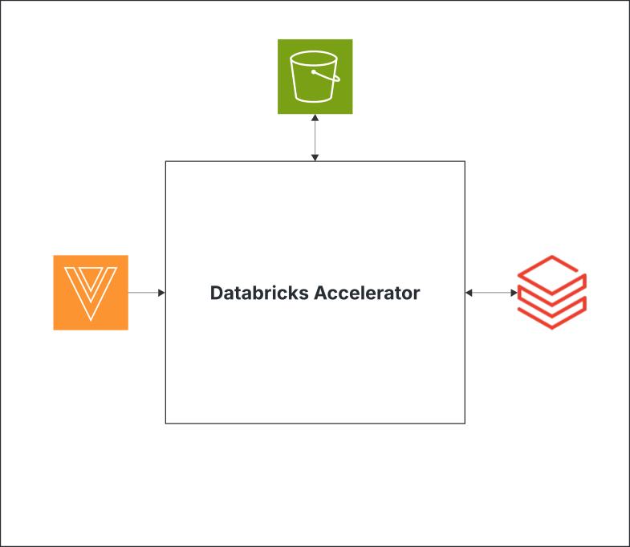
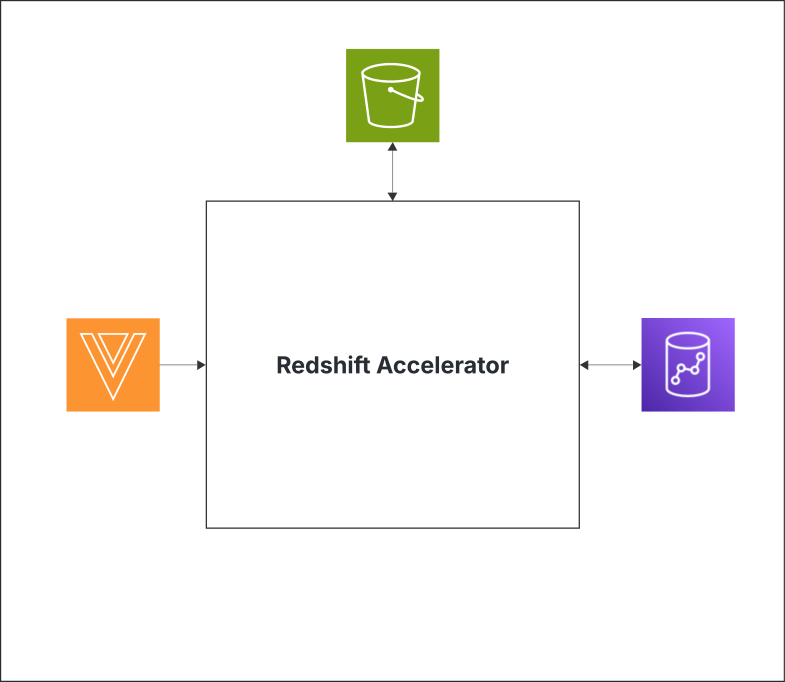

# Direct Data Accelerator

## Introduction

[Direct Data API](https://developer.veevavault.com/directdata/) is a new class of API that provides high-speed read-only data access to Vault. Direct Data API is a reliable, easy-to-use, timely, and consistent API for extracting Vault data. It is designed for organizations that wish to replicate large amounts of Vault data to an external database, data warehouse, or data lake.

The Direct Data accelerators are discrete groups of Python scripts, intended to facilitate the loading of data from Vault to external systems. Each accelerator provides a working example of using Direct Data API to connect Vault to an object storage system and a target data system.

## Overview

This project provides accelerator implementations that facilitate the loading of data from Vault to the following systems:
* Snowflake
* Databricks
* Redshift

These accelerators perform the following fundamental processes:
* Downloads Direct Data files from Vault and uploading to S3
* Extracts content from the archived Direct Data file
* Optionally converts the extracted CSV files to Parquet
* Loads the data into the target data system

## Architecture

The architecture of the accelerators is designed to be easily extendable, so that they can be custom fit to individual developer needs and systems. The core components of each accelerator are below.

### Core Components

**Classes:**

The four fundamental classes that are being leveraged by each accelerator are:
* **`VaultService`**: This class handles all the interactions with Vault. This primarily consists of executing API calls (e.g., authentication, listing and downloading direct Data files and document source content).
* **`ObjectStorageService`**: This class interacts with the system that handles the files extracted from Vault. Right now, this class is solely extended to handle AWS S3 interactions.
* **`DatabaseService`**: This class handles interactions with the target database. This includes loading Full, Incremental, and Log files. This also means that the table schemas are managed here as well.
* **`DatabaseConnection`**: This class handles connecting to the target database, activating a database cursor, and executing SQL commands. This is utilized by the `DatabaseService` execute the specific database SQL commands.

These classes, except for the `VaultService` class, can be extended to support any target system.

**Scripts:**

The logic that moves and transforms data between systems is handled in the included scripts.
* **`accelerator.py`**: This is the entry point for the program. It’s used to instantiate the required classes and pass them into the following scripts that contain the core logic.
* **`direct_data_to_object_storage.py`**: This script handles downloading a designated Direct Data filet from Vault, and uploading the Direct Data tar.gz file to an Object Storage system, currently S3. This script handles multiple file parts natively.

* **`download_and_unzip_direct_data_files.py`**: This script downloads the Direct Data file from S3, unzips the content, optionally converts the CSV files to parquet format, and uploads the unzipped content back to S3.

* **`load_data.py`**: This script facilitates loading the CSV extracts from object storage into tables in the target data system. Logic is included to handle Full, Incremental, and Log file types.

**Configuration Files:**

Each accelerator includes two configuration files that include the required parameters for connecting to Vault and the external systems. Each accelerator’s config file has examples of required parameters for that specific implementation. The files are described below.
* **`vapil_settings.json`**: This file contains the required parameters to authenticate to Vault, and will vary depending on if a Basic username/password or Oauth security policy is used in the target Vault.
* **`connector_config.json`**: This file contains the required parameters to connect to the external object storage and data system. The parameters will vary depending on the systems being connected. Review the sample files for each accelerator implementation for examples.

## Implementations

To use the Direct Data accelerators, see the following prerequisites. Individual implementations will have additional prerequisites.
* [AWS CLI](https://docs.aws.amazon.com/cli/latest/userguide/getting-started-install.html) installed
* [Python v3.10 or higher](https://www.python.org/downloads/)

The following accelerator implementations are currently available as working examples.

### Snowflake Accelerator

This accelerator leverages the ability to integrate Snowflake with S3 and seamlessly load data directly from S3 into Snowflake. This process utilizes the [`COPY INTO`](https://docs.snowflake.com/en/sql-reference/sql/copy-into-table) command that allows for loading directly from a file in addition to inferring the table schema from the same file. Inferring schemas is generally recommended only when dealing with Full files.

**Pre-requisites**
* [S3 to Snowflake integration](https://docs.snowflake.com/en/user-guide/data-load-s3-config-storage-integration)
* [S3 Stage](https://docs.snowflake.com/en/user-guide/data-load-s3-create-stage)
* The following must be present:
    * [Database](https://docs.snowflake.com/en/sql-reference/sql/create-database)
    * [Schema](https://docs.snowflake.com/en/sql-reference/sql/create-schema)
    * A [role](https://docs.snowflake.com/en/sql-reference/sql/create-role) with desired permissions

### Databricks Accelerator

There are [several ways](https://docs.databricks.com/aws/en/ingestion/) to handle and load data into Databricks. The DataBricks accelerator utilizes the `COPY INTO` command to load data directly from S3 to Delta Lake.

**Pre-requisites**
* [Configure data access for ingestion](https://docs.databricks.com/aws/en/ingestion/cloud-object-storage/copy-into/configure-data-access)
* The following must be present:
    * [Catalog](https://docs.databricks.com/aws/en/sql/language-manual/sql-ref-syntax-ddl-create-catalog)
    * [Schema](https://docs.databricks.com/aws/en/sql/language-manual/sql-ref-syntax-ddl-create-schema)

**Considerations**
* Due to the disparity between data classes and formats in Vault and what is accepted by DataBricks, only CSV loading is supported right now.
* The data that gets loaded into Delta Lake tables are loaded as a String data type.
* Additional logic can be implemented to [read Parquet](https://docs.databricks.com/aws/en/query/formats/parquet) files directly.

### Redshift Accelerator

Similar to the other accelerators, the Redshift accelerator leverages the [`COPY`](https://docs.aws.amazon.com/redshift/latest/dg/r_COPY.html) command to load data into tables from S3. Redshift does allow loading using CSV and PARQUET formats, but the schemas cannot be inferred. Therefore, the table schemas will always be handled manually.

**Pre-requisites**
* [Appropriate permissions and access to Redshift and S3](https://docs.aws.amazon.com/redshift/latest/dg/r_COPY.html#r_COPY-permissions)

**Considerations**
* Amazon Redshift [character type](https://docs.aws.amazon.com/redshift/latest/dg/r_Character_types.html) has a limit of 65535 bytes.
* Due to this limit, some Rich Text field data may be truncated.