# Direct Data Accelerator

## Introduction

[Direct Data API](https://developer.veevavault.com/directdata/) is a new class of API that provides high-speed read-only data access to Vault. Direct Data API is a reliable, easy-to-use, timely, and consistent API for extracting Vault data. It is designed for organizations that wish to replicate large amounts of Vault data to an external database, data warehouse, or data lake.

The Direct Data accelerators are discrete groups of Python scripts, intended to facilitate the loading of data from Vault to external systems. Each accelerator provides a working example of using Direct Data API to connect Vault to an object storage system and a target data system.

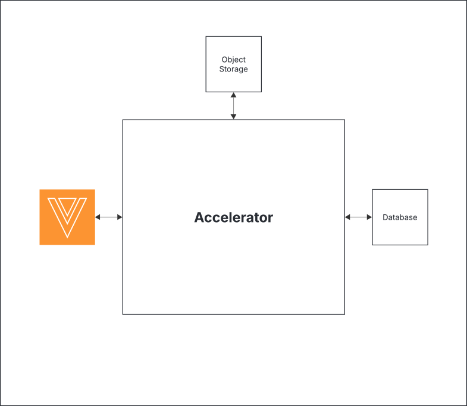

## Overview

This project provides accelerator implementations that facilitate the loading of data from Vault to the following systems:
* Vault -> AWS S3 -> Snowflake
* Vault -> AWS S3 -> Databricks
* Vault -> AWS S3 -> Redshift
* Vault -> Azure Blob Storage -> Azure SQL Database
* Vault -> Azure Blob Storage -> Microsoft Fabric Warehouse
* Vault -> Local Storage -> SQLite (See the [SQLite Accelerator](#sqlite-accelerator) section for more details on this implementation)

These accelerators perform the following fundamental processes:
* Download Direct Data files from Vault and upload them to object storage (currently AWS S3 or Azure Blob Storage)
* Extract content from the archived Direct Data file
* Optionally convert the extracted CSV files to Parquet
* Load the data into the target data system
* Optionally extract document source content from Vault and upload to object storage
* Optionally retrieve document version text from Vault and upload to object storage

## Architecture

The architecture of the accelerators is designed to be easily extendable, so that they can be custom fit to individual developer needs and systems. The core components of each accelerator are below.

### Core Components

**Classes:**

The four fundamental classes that are being leveraged by each accelerator are:
* **`VaultService`**: This class handles all interactions with Vault. This primarily consists of executing API calls (e.g., authentication, listing and downloading direct Data files, extracting document source content, and downloading document text).
* **`ObjectStorageService`**: This class interacts with the object storage system that stores the files extracted from Vault. This includes uploading and downloading files, as well as managing file paths. Currently, this service supports AWS S3 and Azure Blob Storage.
* **`DatabaseService`**: This class handles interactions with the target database. This includes loading Full, Incremental, and Log files. Table schemas are managed here as well.
* **`DatabaseConnection`**: This class handles connecting to the target database, activating a database cursor, and executing SQL commands. This is utilized by the `DatabaseService` execute the specific database SQL commands.

These classes, except for the `VaultService` class, can be extended to support any target system.

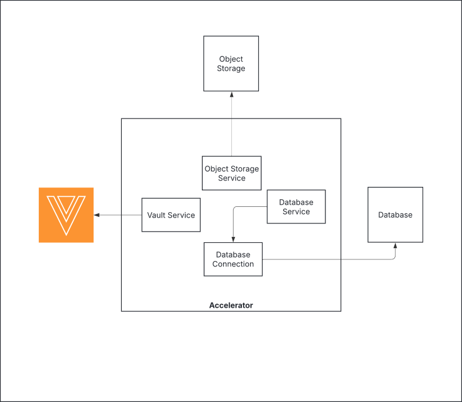

**Configuration Files:**

Each accelerator includes two configuration files that include the required parameters for connecting to Vault and the external systems. Each accelerator’s config file has examples of required parameters for that specific implementation. The files are described below.
* **`vapil_settings.json`**: This file contains the required parameters to authenticate to Vault, and will vary depending on if a Basic username/password or Oauth security policy is used in the target Vault.
```json
{
  "authenticationType": "BASIC",
  "idpOauthAccessToken": "",
  "idpOauthScope": "openid",
  "idpUsername": "",
  "idpPassword": "",
  "vaultUsername": "integration.user@cholecap.com",
  "vaultPassword": "Password123",
  "vaultDNS": "cholecap.veevavault.com",
  "vaultSessionId": "",
  "vaultClientId": "Cholecap-Vault-",
  "vaultOauthClientId": "",
  "vaultOauthProfileId": "",
  "logApiErrors": true,
  "httpTimeout": null,
  "validateSession": true
}
```
* **`connector_config.json`**: This file contains the required parameters to connect to the external object storage and data system. The parameters will vary depending on the systems being connected. Below is an example for the Redshift Connector. Review the sample files for each accelerator implementation for additional examples.
```json
{
  "convert_to_parquet": false,
  "extract_document_content" : true,
  "retrieve_document_text" : true,
  "direct_data": {
    "start_time": "2000-01-01T00:00Z",
    "stop_time": "2025-04-09T00:00Z",
    "extract_type": "incremental"
  },
  "s3": {
    "iam_role_arn": "arn:aws:iam::123456789:role/Direct-Data-Role",
    "bucket_name": "vault-direct-data-bucket",
    "direct_data_folder": "direct-data",
    "archive_filepath": "direct-data/201287-20250409-0000-F.tar.gz",
    "extract_folder": "201287-20250409-0000-F",
    "document_content_folder": "extracted_doc_content",
    "document_text_folder": "extracted_doc_text"
  },
  "redshift": {
    "host": "direct-data.123GUID.us-east-1.redshift.amazonaws.com",
    "port": "5439",
    "user": "user",
    "password": "password",
    "database": "database",
    "schema": "direct_data",
    "iam_redshift_s3_read": "arn:aws:iam::123456789:role/RedshiftS3Read"
  }
}
```

**Scripts:**

The logic that moves and transforms data between systems is handled in the included scripts.
* **`accelerator.py`**: This is the entry point for the program. It’s used to instantiate the required classes and pass them into the following scripts that contain the core logic. Below is an example `accelerator.py` script for the Redshift Accelerator.

```python
import sys

from accelerators.redshift.services.redshift_service import RedshiftService

sys.path.append('.')
from common.scripts import (direct_data_to_object_storage, download_and_unzip_direct_data_files,
                            extract_doc_content, load_data, retrieve_doc_text)
from common.services.aws_s3_service import AwsS3Service
from common.services.vault_service import VaultService
from common.utilities import read_json_file


def main():
  config_filepath: str = "path/to/connector_config.json"
  vapil_settings_filepath: str = "path/to/vapil_settings.json"

  config_params: dict = read_json_file(config_filepath)
  direct_data_params: dict = config_params['direct_data']
  s3_params: dict = config_params['s3']
  redshift_params: dict = config_params['redshift']

  extract_document_content: bool = config_params.get('extract_document_content')
  retrieve_document_text: bool = config_params.get('retrieve_document_text')

  object_storage_root: str = f's3://{s3_params["bucket_name"]}'

  s3_params['convert_to_parquet'] = config_params['convert_to_parquet']
  redshift_params['convert_to_parquet'] = config_params['convert_to_parquet']
  redshift_params['object_storage_root'] = object_storage_root

  s3_service: AwsS3Service = AwsS3Service(s3_params)
  redshift_service: RedshiftService = RedshiftService(redshift_params)
  vault_service: VaultService = VaultService(vapil_settings_filepath)

  direct_data_to_object_storage.run(vault_service=vault_service,
                                    object_storage_service=s3_service,
                                    direct_data_params=direct_data_params)

  download_and_unzip_direct_data_files.run(object_storage_service=s3_service)

  load_data.run(object_storage_service=s3_service,
                database_service=redshift_service,
                direct_data_params=direct_data_params)

  if extract_document_content:
    extract_doc_content.run(object_storage_service=s3_service,
                            vault_service=vault_service)

  if retrieve_document_text:
    retrieve_doc_text.run(object_storage_service=s3_service,
                          vault_service=vault_service)


if __name__ == "__main__":
  main()

```
* **`direct_data_to_object_storage.py`**: This script handles downloading a designated Direct Data file from Vault, and uploading the Direct Data tar.gz file to an object storage system. This script handles multiple file parts natively.

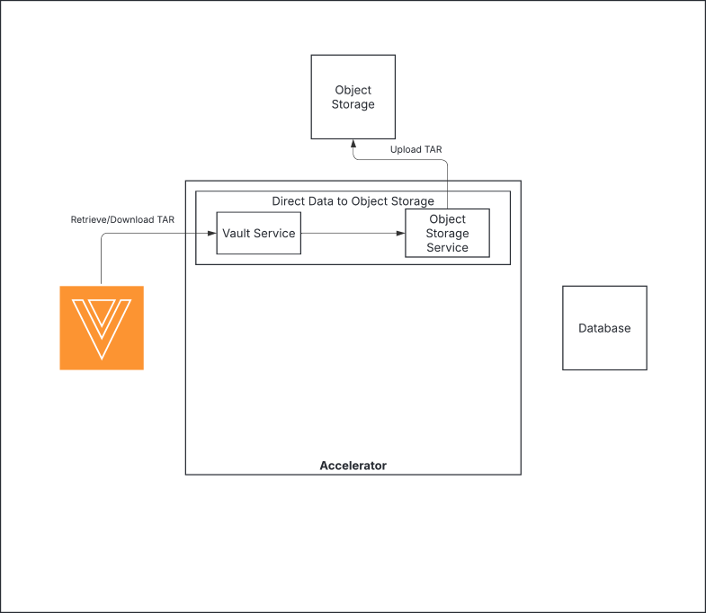

* **`download_and_unzip_direct_data_files.py`**: This script downloads the Direct Data file from object storage, unzips the content, optionally converts the CSV files to parquet format, and uploads the unzipped content back to the object storage system.

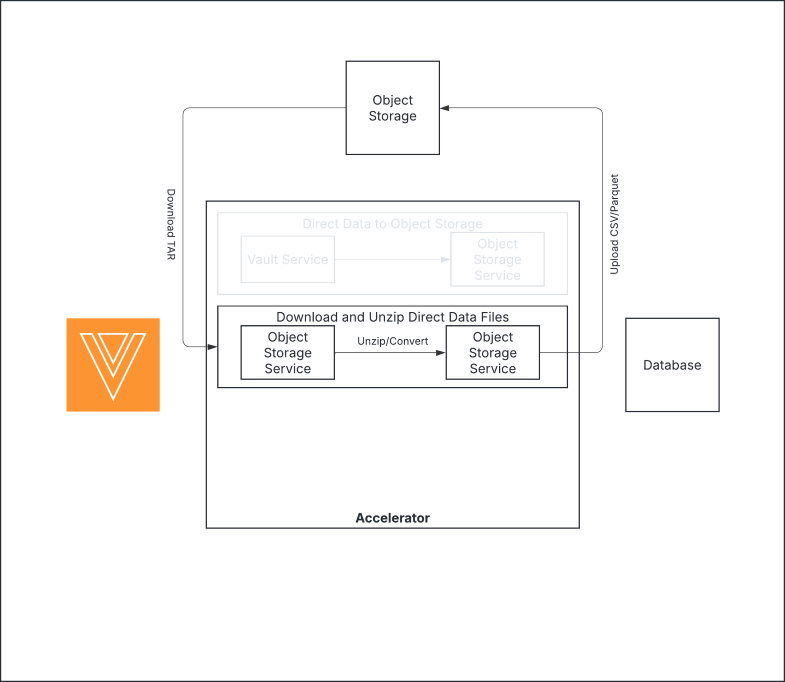

* **`load_data.py`**: This script facilitates loading the direct data extracts from object storage into tables in the target data system. Logic is included to handle Full, Incremental, and Log file types.

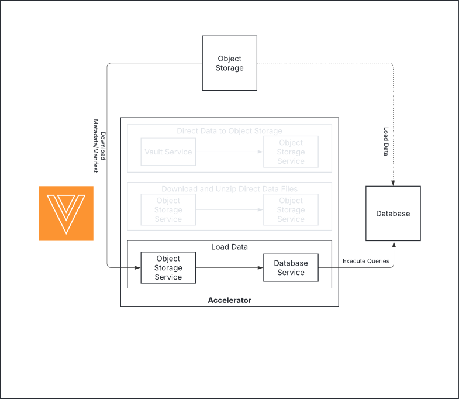

* **`extract_doc_content.py`**: This script retrieves the doc version IDs from the Full or Incremental document_version_sys.csv file, calls the Export Document Versions endpoint to export document content to File Staging, then downloads the content from File Staging and uploads to object storage.

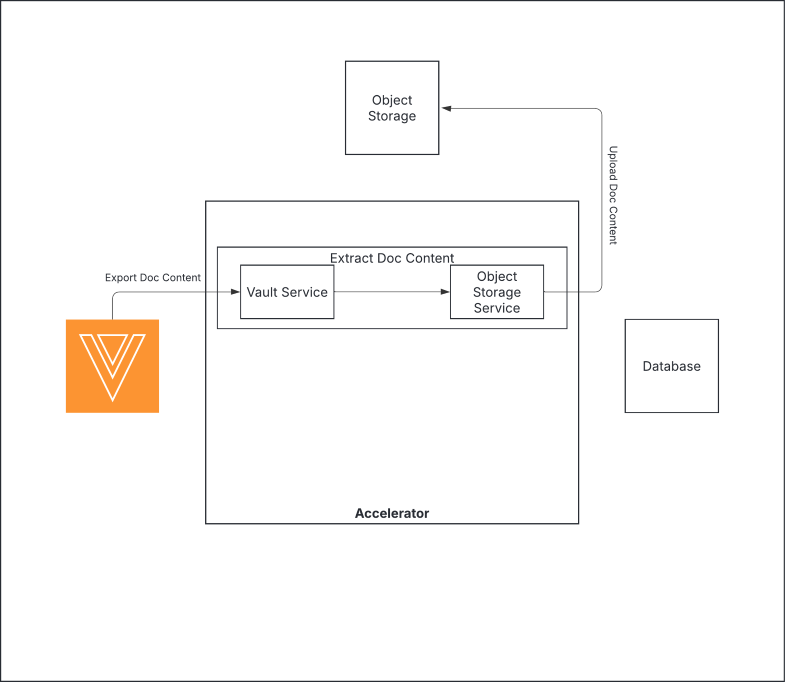

* **`retrieve_doc_text.py`**: This script retrieves the doc version IDs from the Full or Incremental document_version_sys.csv file, calls the Retrieve Document Version Text endpoint, then saves the content to a text file in object storage.

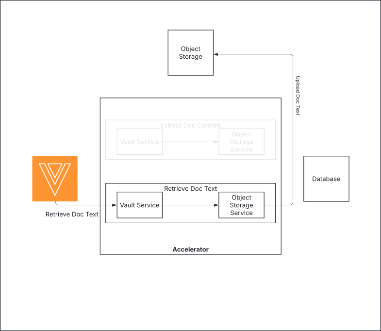

## Implementations

To use the Direct Data accelerators, see the following prerequisites. Individual implementations will have additional prerequisites.
* [Python v3.10 or higher](https://www.python.org/downloads/)

The following accelerator implementations are currently available as working examples.

### Snowflake Accelerator

This accelerator leverages the ability to integrate Snowflake with S3 and seamlessly load data directly from S3 into Snowflake. This process utilizes the [`COPY INTO`](https://docs.snowflake.com/en/sql-reference/sql/copy-into-table) command that allows for loading directly from a file in addition to inferring the table schema from the same file. Inferring schemas is generally recommended only when dealing with Full files.

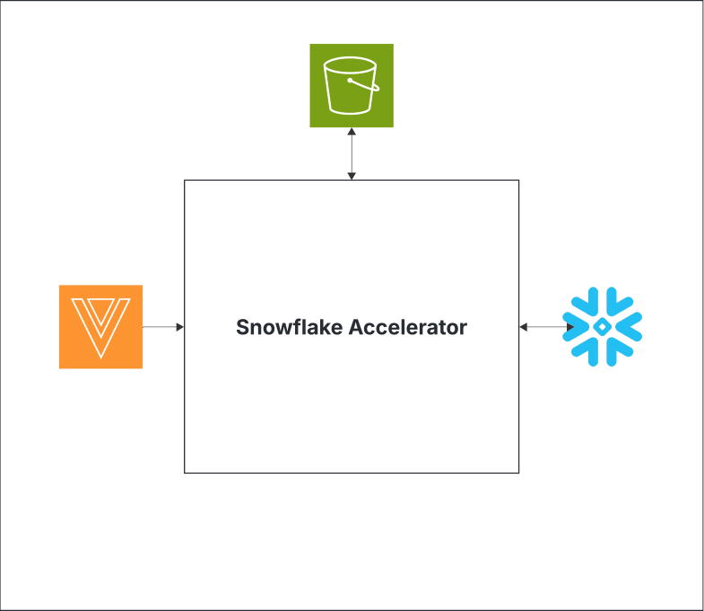

**Pre-requisites**
* [AWS CLI](https://docs.aws.amazon.com/cli/latest/userguide/getting-started-install.html)
* [S3 to Snowflake integration](https://docs.snowflake.com/en/user-guide/data-load-s3-config-storage-integration)
* [S3 Stage](https://docs.snowflake.com/en/user-guide/data-load-s3-create-stage)
* The following must be present:
    * [Database](https://docs.snowflake.com/en/sql-reference/sql/create-database)
    * [Schema](https://docs.snowflake.com/en/sql-reference/sql/create-schema)
    * A [role](https://docs.snowflake.com/en/sql-reference/sql/create-role) with desired permissions
  
**Supported File Formats**
* CSV
* PARQUET

### Databricks Accelerator

There are [several ways](https://docs.databricks.com/aws/en/ingestion/) to handle and load data into Databricks. The DataBricks accelerator utilizes the `COPY INTO` command to load data directly from S3 to Delta Lake.

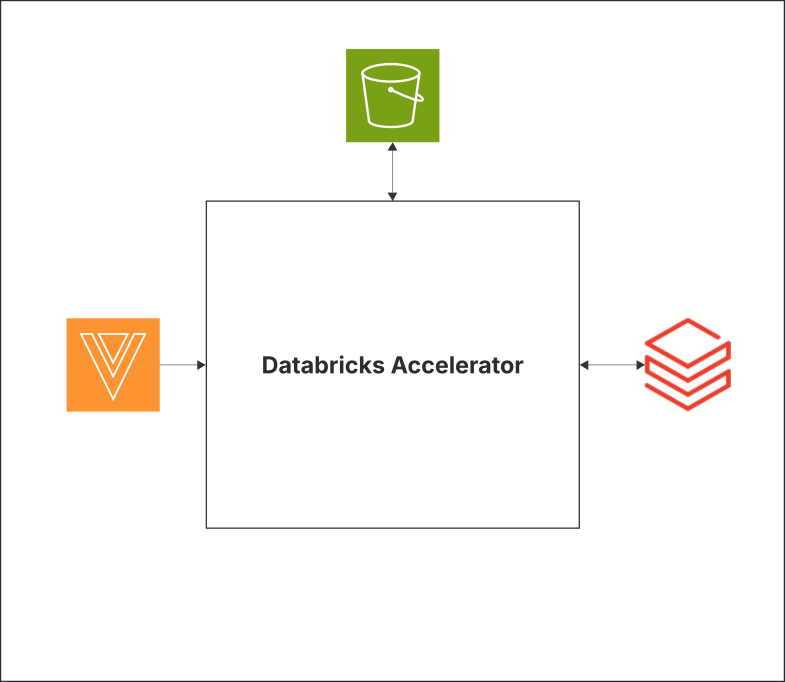

**Pre-requisites**
* [AWS CLI](https://docs.aws.amazon.com/cli/latest/userguide/getting-started-install.html)
* [Configure data access for ingestion](https://docs.databricks.com/aws/en/ingestion/cloud-object-storage/copy-into/configure-data-access)
* The following must be present:
    * [Catalog](https://docs.databricks.com/aws/en/sql/language-manual/sql-ref-syntax-ddl-create-catalog)
    * [Schema](https://docs.databricks.com/aws/en/sql/language-manual/sql-ref-syntax-ddl-create-schema)

**Supported File Formats**
* CSV

**Considerations**
* The data that gets loaded into Delta Lake tables are loaded as a String data type.

### Redshift Accelerator

Similar to the other accelerators, the Redshift accelerator leverages the [`COPY`](https://docs.aws.amazon.com/redshift/latest/dg/r_COPY.html) command to load data into tables from S3.

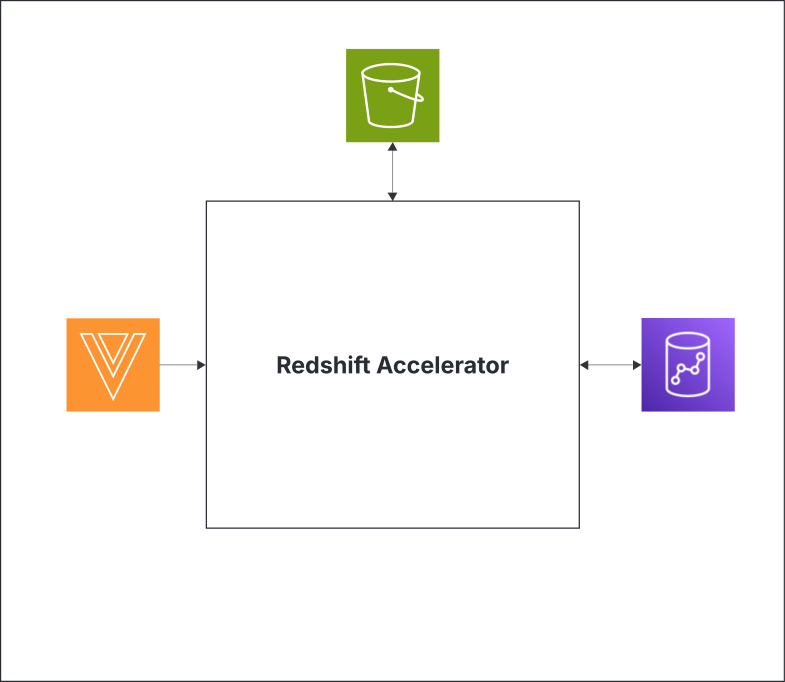

**Pre-requisites**
* [AWS CLI](https://docs.aws.amazon.com/cli/latest/userguide/getting-started-install.html)
* [Appropriate permissions and access to Redshift and S3](https://docs.aws.amazon.com/redshift/latest/dg/r_COPY.html#r_COPY-permissions)

**Supported File Formats**
* CSV

**Considerations**
* Amazon Redshift [character type](https://docs.aws.amazon.com/redshift/latest/dg/r_Character_types.html) has a limit of 65535 bytes.
* Due to this limit, some Rich Text field data may be truncated.

### SQL Database Accelerator

The SQL Database accelerator leverages the [`BULK INSERT`](https://learn.microsoft.com/en-us/sql/t-sql/statements/bulk-insert-transact-sql?view=sql-server-ver17) command to load data into tables from Blob Storage.

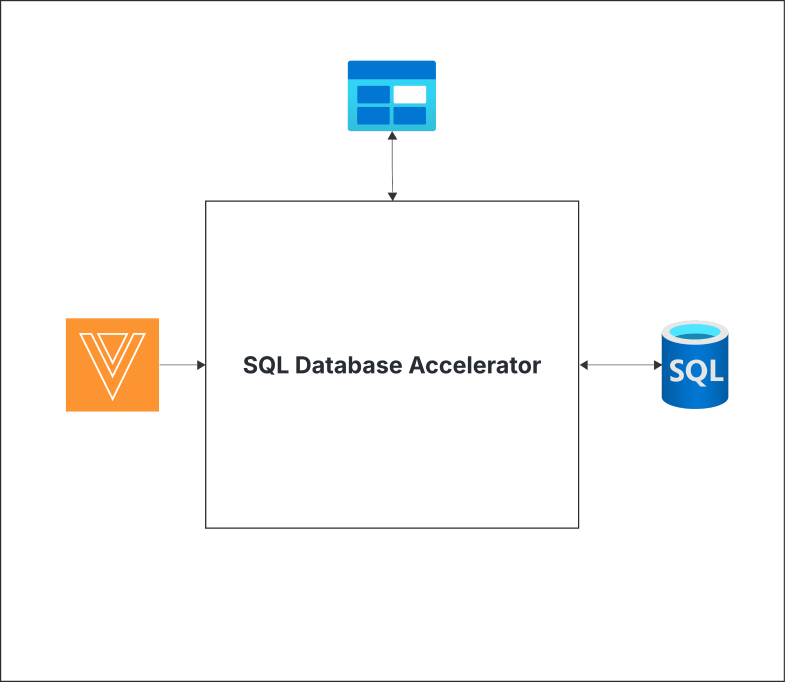

**Pre-requisites**
* [Azure Storage Account](https://learn.microsoft.com/en-us/azure/storage/blobs/storage-blobs-introduction#storage-accounts)
* [Blob Container](https://learn.microsoft.com/en-us/azure/storage/blobs/storage-blobs-introduction#containers)
* [Master Key](https://learn.microsoft.com/en-us/sql/t-sql/statements/create-master-key-transact-sql?view=sql-server-ver17)
* [Storage Access Signature](https://learn.microsoft.com/en-us/rest/api/storageservices/delegate-access-with-shared-access-signature)
* [Database Scoped Credential](https://learn.microsoft.com/en-us/sql/t-sql/statements/create-database-scoped-credential-transact-sql?view=sql-server-ver17)
* [External Data Source](https://learn.microsoft.com/en-us/sql/t-sql/statements/create-external-data-source-transact-sql?view=azuresqldb-current&preserve-view=true&tabs=dedicated)

**Supported File Formats**
* CSV

**Considerations**
* Boolean values from Vault are loaded as an NVARCHAR data type.

### Fabric Warehouse Accelerator

The Fabric accelerator leverages the [`COPY INTO`](https://learn.microsoft.com/en-us/sql/t-sql/statements/copy-into-transact-sql?view=fabric&preserve-view=true) command to load data into tables from Blob Storage.

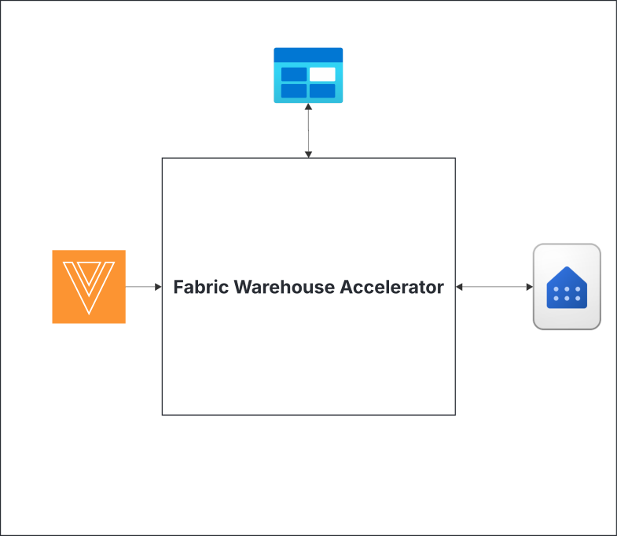

**Pre-requisites**
* [Azure Storage Account](https://learn.microsoft.com/en-us/azure/storage/blobs/storage-blobs-introduction#storage-accounts)
* [Blob Container](https://learn.microsoft.com/en-us/azure/storage/blobs/storage-blobs-introduction#containers)
* [Fabric Workspace](https://learn.microsoft.com/en-us/fabric/fundamentals/workspaces)
* [Fabric Warehouse](https://learn.microsoft.com/en-us/fabric/data-warehouse/data-warehousing)

**Supported File Formats**
* CSV
* PARQUET

### SQLite Accelerator

The SQLite Accelerator leverages the [Pandas Python library](https://pandas.pydata.org/pandas-docs/version/2.2/index.html) and the [Dataframe#to_sql()](https://pandas.pydata.org/pandas-docs/version/2.2/reference/api/pandas.DataFrame.to_sql.html) command to load
data from the CSV files into a local SQLite database.

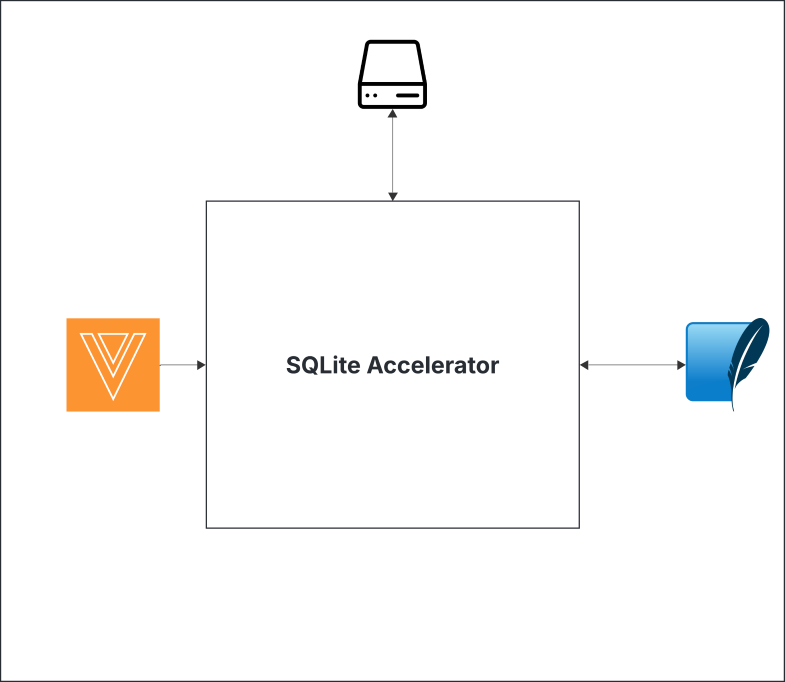

The SQLite Accelerator differs from the other Accelerators, because the files and database are stored locally. The specific implementation details are below.

**Architecture**

This accelerator performs the following fundamental processes:
* Download a Direct Data file from Vault and save it to local storage
* Extract content from the local Direct Data file
* Load the CSV data into a SQLite database

The following classes are being leveraged by the SQLite Accelerator:
* **`VaultService`**: This class handles all interactions with Vault. This primarily consists of executing API calls (e.g., authentication, listing and downloading direct Data files).
* **`DatabaseService`**: This class handles interactions with the sqlite database. This includes loading Full, Incremental, and Log files. Table schemas are managed here as well.
* **`DatabaseConnection`**: This class handles connecting to the sqlite database, activating a database cursor, and executing SQL commands. This is utilized by the `DatabaseService` execute the specific database SQL commands.

The logic that moves and transforms data between systems is handled in the included scripts.
* **`download_direct_data_file.py`**: This script handles downloading a designated Direct Data file from Vault to local storage. This script handles multiple file parts natively.
* **`unzip_direct_data_file.py`**: This script handles unzipping a local Direct Data File.
* **`load_data.py`**: This script facilitates loading the direct data extracts into a SQLite Database. Logic is included to handle Full, Incremental, and Log file types.

**Pre-requisites**
* [SQLite v3.50.4 or later](https://www.sqlite.org/download.html)

**Supported File Formats**
* CSV
